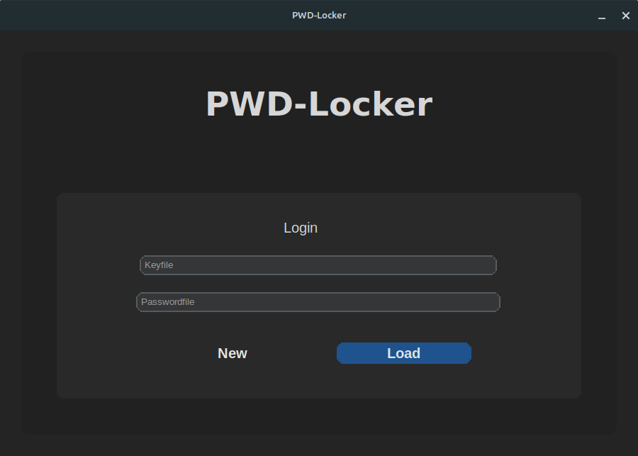
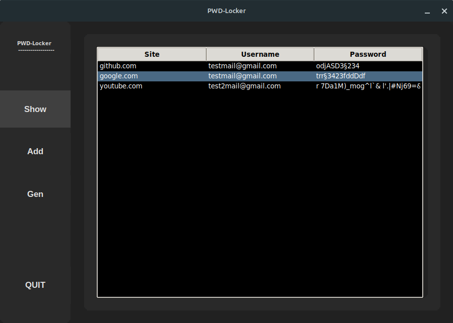
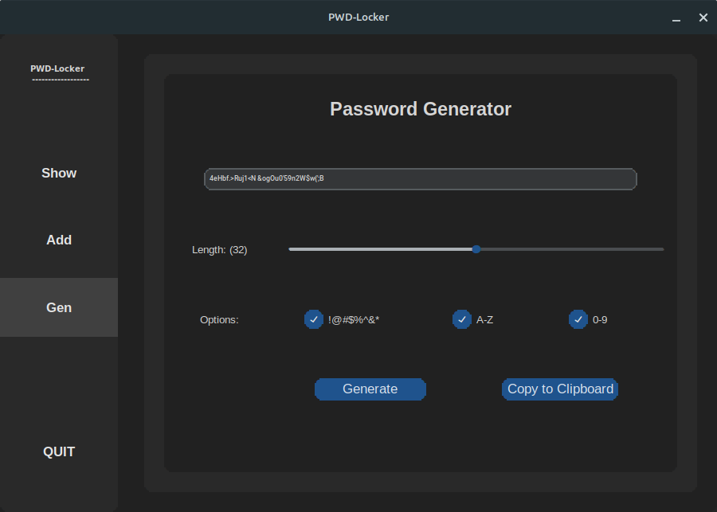
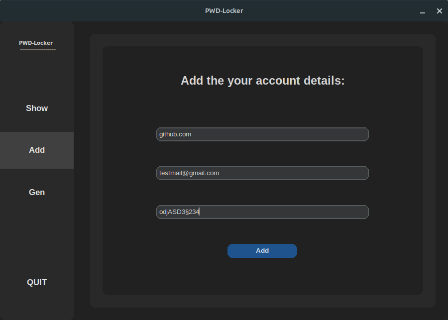

# pwd-locker

pwd-locker is an small, unfinished free time gui manager project, to store and encrypt passwords locally.

# Features
## 1. Encryption and Decryption
The Password Manager uses the AES-256 encryption algorithm to securely encrypt and decrypt passwords and other sensitive data. It employs a key derivation function (Scrypt) to derive a strong encryption key. This ensures that even if the encrypted data is compromised, it cannot be easily decrypted without the correct key.

## 2. Secure Storage
Passwords and other data are stored in a file that is encrypted using AES-256. The encrypted file can only be accessed and decrypted with the correct key, providing an additional layer of security to protect against unauthorized access.

## 3. Password Generation
The Password Manager offers a password generation feature, allowing users to easily create strong and random passwords. Users can specify the length of the password as well as include or exclude special characters, digits, and uppercase letters to meet specific requirements.

## 4. User-Friendly Interface
The Password Manager provides a simple and intuitive command-line interface that allows users to add, view, and manage their passwords. Users can easily add new passwords, view existing passwords, and delete or modify passwords as needed.

## 5. Key Management
The Password Manager supports key management functionalities, allowing users to create and load encryption keys. Encryption keys are securely generated and can be saved to a file for future use. This ensures that the encrypted data can only be accessed by users with the correct key.

## 6. Error Handling
The Password Manager includes error handling mechanisms to provide informative error messages and handle common issues such as file not found errors or incorrect input values. This improves the overall usability and reliability of the script.

# Roadmap
- Adding an section to securly store notes
- Browse button for login file path opening
- Warning if you reuse passwords
- Import passwords from different other password managing systems
- Search for Passwords
- and much more

# Installation

Include instructions on how to install and set up your project. You can provide step-by-step instructions or commands to be executed.

# Usage

## WARNING! Some features like a popup as you are going to delete passwords still have to be added!
Via the Delete-Key you will delete the current selected password!

## 1. Create an key and password file
The name you enter will be the path of the generated files. After generating your password and key file are automatically loaded.

## 2. Add your password data via the add button in the sidebar
After you  once hit the add button, if no popup appears your data is securely added, and encrypted to your password file. You can add as much passwords to the file as you want. You can before go to the generating tab and save an secure random password to your Clipboard.

  
## 3. You can close the program, all information is securely written to your password file and encrypted with the key.
  However everyone with acess to the key will be able to restore your password. For this sake never put your key and password file on the same device, as this poses as an security risk. An secure option is to put one file on an USB-Stick and leave one file on your device.
  
## Also please dont forget to backup your files!

## Contributing

Explain how others can contribute to your project. You can include guidelines for reporting bugs, submitting feature requests, or contributing code.

## License
The Password Manager is released under the [MIT License](LICENSE). You are free to modify, distribute, and use the script for personal or commercial purposes, subject to the terms and conditions of the license.

